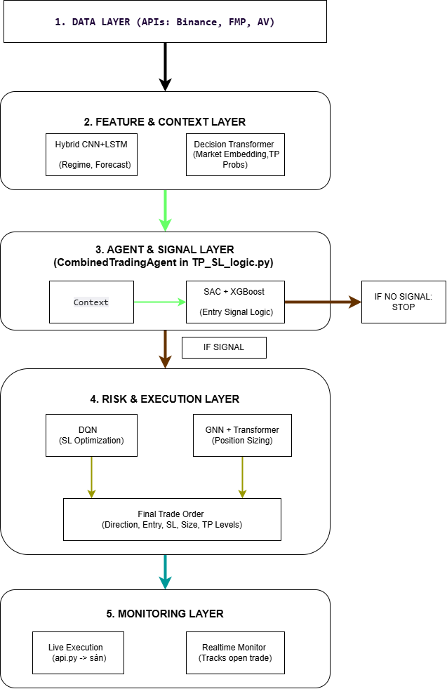

# Project-Hydra: An Experimental Quantitative Trading Framework

[](https://opensource.org/licenses/MIT)
[](https://www.python.org/downloads/release/python-3110/)

An experimental quantitative trading framework featuring a GNN+Transformer for position sizing, a DQN for stop-loss optimization, and a SAC+XGBoost hybrid for entry signals.

**Disclaimer:** This is a personal research project built in a short timeframe. It is not financial advice and is for educational/experimental purposes only. Use at your own risk.

---

## 🏛️ Architecture Overview

Project-Hydra is designed as a multi-agent, specialized system. Instead of a single monolithic model, it employs a suite of AI models, each trained for a specific, discrete task within the trading lifecycle. This modular approach allows for targeted optimization and research into each component.



The framework operates as a multi-stage, sequential pipeline, where the output of one stage becomes the input for the next. This ensures that decisions are made with the maximum available context.

1.  **Context Generation:** The pipeline begins with raw, multi-timeframe market data. This data is enriched with technical indicators and then fed into two parallel AI models to build a comprehensive market context:
    *   A **Hybrid CNN+LSTM Model** analyzes multiple timeframes to classify the current **Market Regime** (e.g., Trending, Sideways) and generate multi-step forecasts.
    *   A **Decision Transformer Model** processes the data to generate a rich **Market Vector (Embedding)** and calculates the **probability** of the price reaching various Take-Profit levels.

2.  **Signal Generation:** The full market context (Regime, TP Probabilities, Embedding) is passed to the central `CombinedTradingAgent`. This agent generates a potential **Entry Signal** by blending outputs from:
    *   An **XGBoost** model, which provides a probabilistic win-rate for a potential trade.
    *   A **SAC (Soft Actor-Critic)** agent, which has been trained to identify optimal entry policies.

3.  **Specialized Risk Management:** If a high-confidence entry signal is generated, the framework deploys two highly specialized models to manage the trade's risk profile *before* execution:
    *   **Stop-Loss Optimization:** A **DQN** agent determines the **optimal Stop-Loss**, not as a fixed price, but by selecting the best ATR (Average True Range) multiplier for the specific market conditions.
    *   **Position Sizing:** A novel **Graph Neural Network (GNN)** analyzes the market's structural properties for anomalies. This graph-based insight is then fed into a **Transformer** to calculate the **optimal Position Size**, allowing the system to trade larger in safer conditions and smaller when anomalies are detected.

4.  **Execution & Monitoring:** The final, fully-defined trade order (Direction, Entry, SL, Size) is passed to the execution layer. In live mode, the event-driven `RealtimeMonitor` takes over, tracking the open position against its SL/TP thresholds in an asynchronous manner.
---

## 🧠 The Multi-Headed AI Brain

The core of Project-Hydra is its "many-headed" approach to decision-making:

| Task                       | Technology Used       | Description |
| :---                       |     :---              |     :---    |
| **Entry Signal**           | `SAC` + `XGBoost`     | Combines signals from a Reinforcement Learning agent (SAC) and a gradient boosting model (XGBoost) to generate high-confidence entry points.|
| **Position Sizing**        | `GNN` + `Transformer` | A Graph Neural Network analyzes market structure, and its output is fed into a Transformer to determine the optimal capital allocation for the trade. |
| **Stop-Loss Optimization** | `DQN`                 | A Deep Q-Network agent is trained to dynamically select the optimal ATR (Average True Range) multiplier for the stop-loss, adapting to each specific trade setup. |
| **Market Vector & TP**     | `Transformer`         | A standalone Transformer model creates a market state embedding and predicts the probability of reaching various Take-Profit levels. |
| **Regime & Forecast**      | `CNN` + `LSTM`        | A hybrid model provides context on the current market regime (Trending/Sideways) and generates multi-step price forecasts. |
| **Sentiment Analysis**     | `NLP` / `API`         | Integrates external news and financial event data to act as a filter or a factor in risk assessment. |

---

## 📁 File Structure

The project is organized into several key directories:
-   `/src`: Contains the core application logic, including the main bot (`api.py`), the decision agent (`TP_SL_logic.py`), and the real-time monitor.
-   `/scripts`: Holds all scripts intended for local execution, such as model training, data preparation, and hyperparameter optimization.
-   `/experiments`: Contains standalone experimental versions of the bot, including a version using a Bayesian Neural Network (`bayesian_net_agent`) and versions adapted for the Kaggle environment (`kaggle_notebooks`).
-   `/tools`: Utility scripts for checking API connectivity and other small tasks.

---

## 🚀 Getting Started

### Prerequisites

-   Python 3.11+
-   API keys for Binance, Financial Modeling Prep (FMP), and Alpha Vantage.

### Installation

1.  **Clone the repository:**
    ```bash
    git clone https://github.com/Dung2005qk/Project-Hydra-Quantitative-Trading-Lab.git
    cd Project-Hydra-Quantitative-Trading-Lab
    ```

2.  **Set up environment variables:**
    ```bash
    cp .env.example .env
    ```
    Then, fill in your API keys in the newly created `.env` file.

3.  **Install dependencies:**
    ```bash
    pip install -r requirements.txt
    ```
    ⚠️ **Note:** Installing `torch-geometric` and `talib` can be complex. Please refer to their official documentation for instructions specific to your system (OS, CUDA version).

### Usage

1.  **Prepare Data:** Run the necessary scripts in `/scripts/data_preparation/` to fetch and process historical data.
2.  **Train Models:** Run the training scripts located in `/scripts/training/`. It is recommended to run hyperparameter optimization scripts first.
3.  **Run the Bot:** Execute the main application for backtesting or live trading.
    ```bash
    python src/api.py
    ```

---

## 📜 License

This project is licensed under the MIT License. See the [LICENSE](LICENSE) file for details.